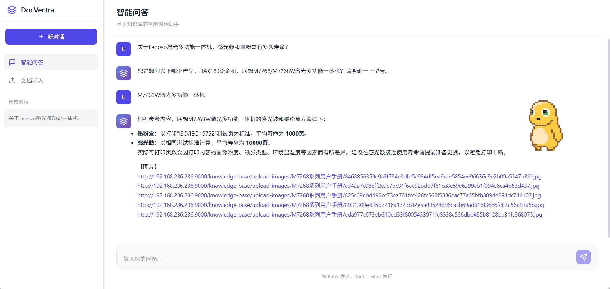
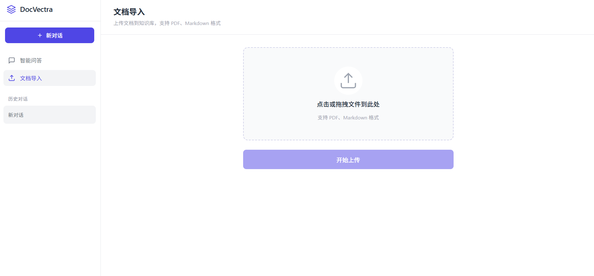
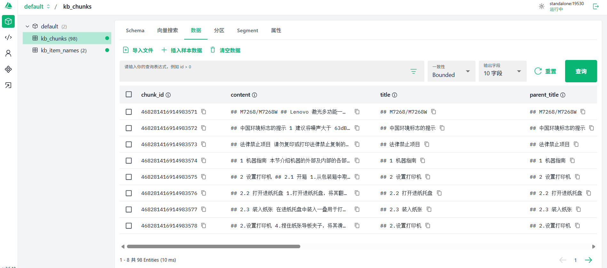
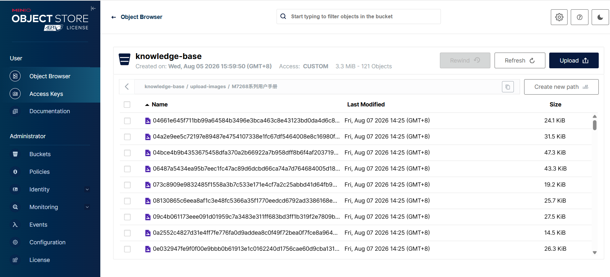

# DocVectra

> **下一代企业级 RAG 知识引擎** — 融合多路召回、语义重排序与 LangGraph 智能编排，为垂直领域打造毫秒级精准知识检索与流式智能问答系统。

## 项目定位

DocVectra 面向电子产品技术手册、维修指南、工业文档等高密度知识场景，构建从**非结构化文档解析**到**语义级知识检索**再到**流式智能推理**的完整闭环。系统以 LangGraph 有状态图编排为中枢，串联稠密/稀疏双路向量检索、HyDE 假设文档扩展、MCP 实时联网搜索、Reranker 语义重排序与断崖检测截断等核心技术栈，实现检索精度与响应速度的双重突破。

## 核心功能

| 功能 | 技术深度 |
|------|----------|
| **文档智能解析管线** | MinerU 高精度 PDF 解析 → 多模态 Markdown 转换 → 语义感知智能切片 → BGE-M3 双路向量化（1536维稠密 + 1024维稀疏），全链路自动化 |
| **混合双路向量检索** | 稠密语义向量（OpenAI text-embedding-v4）+ 稀疏 BM25 关键词向量，双路并行检索覆盖语义理解与精确匹配 |
| **多路召回融合引擎** | 向量检索 + HyDE 假设文档扩展 + MCP 实时联网搜索，三路召回结果通过 RRF（Reciprocal Rank Fusion）算法智能融合 |
| **语义重排序与断崖检测** | BGE-Reranker-Large 本地重排序模型 + 自适应断崖检测算法，动态截断低相关度结果，确保答案质量 |
| **SSE 流式推理输出** | 基于 Server-Sent Events 的实时流式推送，逐 token 输出，零等待交互体验 |
| **全链路会话状态管理** | MongoDB 持久化对话历史 + Redis 任务状态追踪，支持多轮上下文推理与断点续传 |

## 界面预览

### 智能问答



简洁的对话式交互界面，支持流式输出，实时展示 AI 回答。左侧边栏提供新建对话、文档导入和历史记录入口。

### 文档导入



支持 PDF 和 Markdown 文件批量上传，自动解析文档内容并进行向量化处理，导入过程中实时显示进度。

## 系统架构

| 模块 | 职责 | 技术实现 |
|------|------|----------|
| **API 层** | HTTP 接口暴露、请求路由 | FastAPI + Uvicorn |
| **Processor 层** | 业务流程编排、节点调度 | LangGraph |
| **Utils 层** | 工具函数封装、外部服务调用 | Python 模块 |
| **数据层** | 数据持久化、检索 | Milvus / MongoDB / MinIO |

## 项目结构

```
DocVectra/
├── backend/                 # 后端 API 服务（统一入口）
│   ├── main.py              # FastAPI 统一入口
│   ├── health_check.py      # 依赖服务健康检查
│   └── api/
│       ├── import_service.py    # 文档导入 API
│       └── query_service.py     # 智能问答 API
├── frontend/                # 前端（Vue 3 + Vite）
│   ├── src/
│   │   ├── views/           # 页面组件（Chat/Import）
│   │   ├── components/      # 通用组件（Sidebar）
│   │   ├── stores/          # Pinia 状态管理
│   │   ├── services/        # API 请求封装
│   │   └── router/          # 路由配置
│   └── package.json
├── processor/
│   ├── import_processor/    # 文档导入流程
│   │   ├── nodes/           # 工作流节点
│   │   │   ├── node_pdf_to_md.py          # PDF 转 Markdown
│   │   │   ├── node_md_img.py             # Markdown 图片处理
│   │   │   ├── node_document_split.py     # 文档智能切片
│   │   │   ├── node_bge_embedding.py      # BGE 向量化
│   │   │   ├── node_item_name_recognition.py  # 商品名识别
│   │   │   └── node_import_milvus.py      # Milvus 入库
│   │   ├── config.py        # 配置管理
│   │   ├── state.py         # 状态定义
│   │   └── main_graph.py    # LangGraph 主图
│   └── query_processor/     # 查询检索流程
│       ├── nodes/           # 工作流节点
│       │   ├── node_search_embedding.py       # 向量检索
│       │   ├── node_search_embedding_hyde.py  # HyDE 检索
│       │   ├── node_web_search_mcp.py         # MCP 联网搜索
│       │   ├── node_rrf.py                    # RRF 融合
│       │   ├── node_rerank.py                 # 重排序
│       │   ├── node_item_name_confirm.py      # 商品名确认
│       │   └── node_answer_output.py          # 答案生成
│       └── main_graph.py    # LangGraph 主图
├── utils/                   # 工具模块（Milvus/MinIO/MongoDB/Redis/SSE）
├── tools/                   # 辅助脚本（日志/模型下载）
├── tests/                   # 单元测试
├── .env.example             # 环境变量示例
└── pyproject.toml           # 项目配置
```

## 核心流程

### 文档导入

```
PDF/文档 → MinerU 解析 → Markdown 图片处理 → 文档智能切片 → BGE 向量化 → 商品名识别 → Milvus 入库
```

### 查询检索

```
用户提问 → 商品名确认 → 向量检索(稠密+稀疏) → HyDE 扩展 → MCP Web 搜索 → RRF 融合 → Rerank 重排序 → 流式生成回答
```

## 技术栈

| 类别 | 技术选型 | 说明 |
|------|----------|------|
| 后端框架 | FastAPI + Uvicorn | 异步高性能 HTTP 服务 |
| 工作流引擎 | LangGraph | 有状态图编排框架 |
| 大语言模型 | 阿里云 DashScope (Qwen) | qwen-flash / qwen3-vl-flash |
| 向量嵌入 | OpenAI text-embedding-v4 + BGE-M3 | 1536维稠密 + 1024维稀疏 |
| 重排序模型 | BGE-Reranker-Large | 本地部署 |
| 向量数据库 | Milvus | 混合检索（稠密+稀疏） |
| 文档数据库 | MongoDB | 对话历史存储 |
| 对象存储 | MinIO | 文件与图片存储 |
| PDF 解析 | MinerU | PDF 转 Markdown |

## 快速开始

### 1. 系统要求

#### 硬件要求
- **GPU**: NVIDIA GPU（推荐 RTX 3060 或更高，显存 ≥ 6GB）用于本地 Embedding 和 Reranker 模型推理
- **内存**: ≥ 16GB RAM
- **磁盘**: ≥ 50GB 可用空间（用于模型缓存和向量数据库）

#### 软件要求
- **操作系统**: Windows 10/11、Linux（Ubuntu 20.04+）、macOS
- **Python**: >= 3.11
- **CUDA**: 12.x（用于 GPU 加速）
- **Node.js**: >= 18（用于前端开发）
- **包管理器**: [uv](https://github.com/astral-sh/uv)（推荐的 Python 包管理工具）

### 2. 依赖服务

在启动项目前，需要确保以下服务已安装并运行：

#### 2.1 Milvus（向量数据库）
```bash
# 使用 Docker 启动 Milvus
docker run -d --name milvus-standalone \
  -p 19530:19530 \
  -p 9091:9091 \
  milvusdb/milvus:v2.4.0
```
验证：访问 http://localhost:9091 查看 Milvus 状态


*Attu 可视化管理界面，支持集合浏览、数据查询和性能监控*

#### 2.2 MongoDB（文档数据库）
```bash
# 使用 Docker 启动 MongoDB
docker run -d --name mongodb \
  -p 27017:27017 \
  mongo:7.0
```
验证：使用 MongoDB Compass 连接 `mongodb://localhost:27017`

#### 2.3 MinIO（对象存储）
```bash
# 使用 Docker 启动 MinIO
docker run -d --name minio \
  -p 9000:9000 \
  -p 9001:9001 \
  -e MINIO_ROOT_USER=minioadmin \
  -e MINIO_ROOT_PASSWORD=minioadmin \
  minio/minio server /data --console-address ":9001"
```
验证：访问 http://localhost:9001（用户名/密码：minioadmin/minioadmin）


*MinIO 对象存储控制台，管理文档和图片资源*

#### 2.4 Redis（任务状态存储）
```bash
# 使用 Docker 启动 Redis
docker run -d --name redis \
  -p 6379:6379 \
  redis:7-alpine
```
验证：`redis-cli ping` 应返回 `PONG`

### 3. 安装依赖

#### 3.1 安装 uv（Python 包管理器）
```bash
# Windows
powershell -c "irm https://astral.sh/uv/install.ps1 | iex"

# Linux/macOS
curl -LsSf https://astral.sh/uv/install.sh | sh
```

#### 3.2 安装 Python 依赖
```bash
# 克隆项目
git clone <your-repo-url>
cd DocVectra

# 创建虚拟环境并安装依赖
uv sync
```

#### 3.3 下载本地模型
项目需要下载以下模型到本地：

```bash
# 下载 BGE-M3 Embedding 模型（约 2GB）
python tools/download_bgem3.py

# 或使用 ModelScope 下载
# 模型会自动缓存到 MODELSCOPE_CACHE 指定的目录
```

### 4. 配置环境变量

```bash
# 复制环境变量模板
cp .env.example .env
```

编辑 `.env` 文件，配置以下关键项：

#### 4.1 LLM API 配置
```bash
# 阿里云 DashScope API Key（必需）
OPENAI_API_KEY=sk-xxxxxxxxxxxxxxxxxxxxxxxxxxxxxxxx

# API 基础地址（默认使用阿里云 DashScope）
OPENAI_API_BASE=https://dashscope.aliyuncs.com/compatible-mode/v1

# 模型选择
LLM_DEFAULT_MODEL=qwen-flash          # 文本生成模型
VL_MODEL=qwen3-vl-flash               # 视觉语言模型（用于图片理解）
ITEM_MODEL=qwen-flash                 # 商品名识别模型
```

#### 4.2 数据库连接配置
```bash
# Milvus 配置
MILVUS_URL=http://localhost:19530
CHUNKS_COLLECTION=kb_chunks
ITEM_NAME_COLLECTION=kb_item_names

# MongoDB 配置
MONGO_URL=mongodb://localhost:27017
MONGO_DB_NAME=kb001

# MinIO 配置
MINIO_ENDPOINT=localhost:9000
MINIO_ACCESS_KEY=minioadmin
MINIO_SECRET_KEY=minioadmin
MINIO_BUCKET_NAME=knowledge-base

# Redis 配置
REDIS_URL=redis://localhost:6379/0
```

#### 4.3 模型路径配置
```bash
# BGE-M3 模型路径（根据实际下载路径修改）
BGE_M3_PATH=/path/to/your/models/BAAI/bge-m3
BGE_M3=BAAI/bge-m3

# BGE Reranker 模型路径
BGE_RERANKER_LARGE=/path/to/your/models/BAAI/bge-reranker-large

# GPU 设备配置
BGE_DEVICE=cuda:0                     # 使用 GPU 0
BGE_FP16=True                         # 启用半精度加速
BGE_RERANKER_DEVICE=cuda:0
BGE_RERANKER_FP16=1
```

#### 4.4 MinerU API 配置（PDF 解析）
```bash
# MinerU API Token（需要申请：https://mineru.net）
MINERU_API_TOKEN=your-mineru-api-token
MINERU_BASE_URL=https://mineru.net/api/v4
```

#### 4.5 MCP Web 搜索配置
```bash
# 阿里云 DashScope MCP Web 搜索服务
MCP_DASHSCOPE_BASE_URL=https://dashscope.aliyuncs.com/api/v1/mcps/WebSearch/sse
```

### 5. 启动服务

#### 5.1 启动后端服务

**方式一：统一入口（推荐）**
```bash
# 启动统一的后端服务（包含导入和查询 API）
uvicorn backend.main:app --host 0.0.0.0 --port 8000 --reload
```

**方式二：分别启动**
```bash
# 终端 1：启动导入服务
uvicorn backend.api.import_service:app --host 0.0.0.0 --port 8000 --reload

# 终端 2：启动查询服务
uvicorn backend.api.query_service:app --host 0.0.0.0 --port 8001 --reload
```

验证后端服务：
- 导入 API 文档：http://localhost:8000/docs
- 查询 API 文档：http://localhost:8001/docs（如果分别启动）
- 健康检查：`curl http://localhost:8000/health`

#### 5.2 启动前端服务

```bash
# 进入前端目录
cd frontend

# 安装依赖
npm install

# 启动开发服务器
npm run dev
```

访问：http://localhost:3000

#### 5.3 生产环境部署

```bash
# 后端生产部署
uvicorn backend.main:app --host 0.0.0.0 --port 8000 --workers 4

# 前端构建
cd frontend
npm run build

# 使用 Nginx 托管前端静态文件
# 配置反向代理到后端 API
```

### 6. 验证部署

#### 6.1 检查服务状态
```bash
# 检查后端服务
curl http://localhost:8000/health

# 检查 Milvus
curl http://localhost:9091

# 检查 MongoDB
mongosh --eval "db.runCommand({ ping: 1 })"

# 检查 Redis
redis-cli ping
```

#### 6.2 测试 API
```bash
# 测试文件上传
curl -X POST http://localhost:8000/import/upload \
  -F "files=@test.pdf"

# 测试查询
curl -X POST http://localhost:8000/query/query \
  -H "Content-Type: application/json" \
  -d '{"query": "测试问题", "session_id": "test-001"}'
```

### 7. 常见问题

#### Q1: GPU 内存不足
```bash
# 修改 .env，关闭半精度或改用 CPU
BGE_FP16=False
BGE_DEVICE=cpu
BGE_RERANKER_FP16=0
BGE_RERANKER_DEVICE=cpu
```

#### Q2: 模型下载失败
```bash
# 使用 ModelScope 镜像
export MODELSCOPE_CACHE=/your/cache/path
python tools/download_bgem3.py
```

#### Q3: MinIO 连接超时
- 检查 MinIO 服务是否启动：`docker ps | grep minio`
- 检查防火墙是否开放 9000 端口
- 验证凭证：访问 http://localhost:9001 登录

#### Q4: Milvus 连接失败
```bash
# 重启 Milvus
docker restart milvus-standalone

# 查看日志
docker logs milvus-standalone
```

#### Q5: Redis 连接失败
```bash
# 检查 Redis 服务
docker ps | grep redis

# 测试连接
redis-cli -h localhost -p 6379 ping
```

## License

MIT
